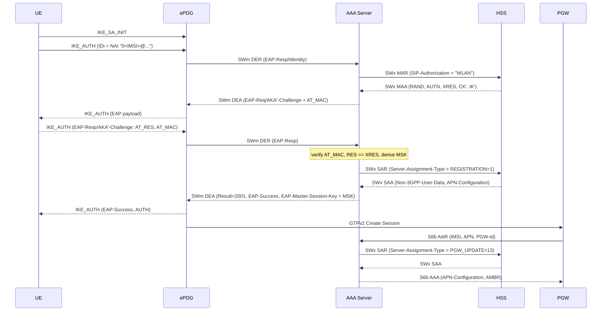

# 3GPP AAA Server

Standalone 3GPP AAA Server (TS 29.273) implementing SWm, SWx, S6b and STa
Diameter interfaces plus an optional RADIUS front-end for Hotspot 2.0 /
Passpoint Carrier-Wi-Fi deployments.

This server is **peer-agnostic**: it does not embed any HSS logic and
plugs into any TS 29.273-conformant HSS (e.g. commercial HSS, open-source
PyHSS with SWx extensions, or a DRA fronting both).

---

## Scope and standards

| Area | Standard |
|------|----------|
| Diameter base protocol | IETF RFC 6733 |
| SWm (ePDG ↔ AAA) — untrusted non-3GPP | 3GPP TS 29.273 §7 |
| SWx (AAA ↔ HSS) | 3GPP TS 29.273 §8 |
| S6b (PGW/SMF ↔ AAA) | 3GPP TS 29.273 §9 |
| STa (trusted WLAN AN ↔ AAA) | 3GPP TS 29.273 §6 |
| EAP | IETF RFC 3748 |
| EAP-AKA | IETF RFC 4187 |
| EAP-AKA' | IETF RFC 5448 |
| Non-3GPP access security | 3GPP TS 33.402 |
| Access Network Identity | 3GPP TS 24.302 §8.1.1 |
| NAI formats | 3GPP TS 23.003 §14, §19.3 |
| RADIUS | IETF RFC 2865 / RFC 3579 |
| MPPE key VSAs | IETF RFC 2548 |

---

## Component architecture

```
          +----------------+
UE ====   |    ePDG        |  SWm  \
          +----------------+        \
                                     \
          +----------------+          +--------+       +-------+
WLAN ===  |  STa AN /      |  STa  ---|  AAA   | SWx --|  HSS  |
          |  RADIUS AN     |  RAD  ---| Server |       +-------+
          +----------------+          |        |
                                      |        |       +-------+
          +----------------+          |        | S6b --|  PGW  |
          |     PGW/SMF    |----------+--------+       +-------+
          +----------------+
```

All four Diameter applications are advertised through a single
`diameter:start_service/2` instance (`aaa_svc`), so a DRA can relay
traffic for multiple apps over one transport connection.

### Key modules

| Module | Responsibility |
|--------|----------------|
| `aaa_diameter_svc` | Owns the shared `aaa_svc` Diameter service, starts listeners/peers |
| `aaa_swm_server` | SWm callbacks (DER/DEA, AAR/AAA, STR/STA, ASR/ASA, RAR/RAA) |
| `aaa_sta_server` | STa callbacks — mirrors SWm with `AN-Trusted = TRUSTED(0)` |
| `aaa_s6b_server` | S6b callbacks (AAR/AAA, STR/STA, ASR/ASA, RAR/RAA) |
| `aaa_swx_client` | SWx originator (MAR/SAR) and RTR/PPR handler |
| `aaa_eap_relay` | EAP-AKA/AKA' state machine |
| `aaa_eap_codec` | EAP packet + attribute TLV codec |
| `aaa_eap_crypto` | PRF', CK'/IK', MSK/EMSK/K_aut, AT_MAC |
| `aaa_nai` | NAI parse/build per TS 23.003 |
| `aaa_network_name` | Access Network Identity per TS 24.302 |
| `aaa_session_mgr` | Dual-indexed session store (SessionId ↔ IMSI, NAI → IMSI) |
| `aaa_radius` | Optional RADIUS front-end (EAP-in-RADIUS → EAP engine) |
| `aaa_http` / `aaa_http_handler` | `/healthz`, `/readyz`, `/metrics`, `/status` |
| `aaa_metrics` | Prometheus-style counters |

---

## TS 29.273 message matrix

### SWm — Application-Id 16777264, Vendor 10415

| Direction | Command | Purpose |
|-----------|---------|---------|
| ePDG → AAA | DER (268) | EAP relay (Identity or Challenge response) |
| AAA → ePDG | DEA (268) | EAP-Request/Challenge or EAP-Success + MSK |
| ePDG → AAA | AAR (265) | Authorization / re-authorization |
| AAA → ePDG | AAA (265) | Non-3GPP-User-Data, APN-Configuration, Session-Timeout |
| ePDG → AAA | STR (275) | UE detach |
| AAA → ePDG | STA (275) | Confirmed |
| AAA → ePDG | ASR (274) | HSS-initiated detach (RTR from HSS propagated) |
| ePDG → AAA | ASA (274) | Abort confirmed |
| AAA → ePDG | RAR (258) | Subscriber profile update (PPR propagated) |
| ePDG → AAA | RAA (258) | Confirmed |

### SWx — Application-Id 16777265, Vendor 10415

| Direction | Command | Purpose |
|-----------|---------|---------|
| AAA → HSS | MAR (303) | Request AKA AV with Network Name (CK'/IK' binding) |
| HSS → AAA | MAA (303) | RAND, AUTN, XRES, CK', IK' |
| AAA → HSS | SAR (301) | Register (1), de-register (5), PGW update (13), data-only (12) |
| HSS → AAA | SAA (301) | Non-3GPP-User-Data, APN-Configuration |
| HSS → AAA | RTR (304) | HSS-initiated de-registration → emits SWm ASR |
| AAA → HSS | RTA (304) | Accepted |
| HSS → AAA | PPR (305) | Profile update → emits SWm RAR |
| AAA → HSS | PPA (305) | Accepted |

### S6b — Application-Id 16777272, Vendor 10415

| Direction | Command | Purpose |
|-----------|---------|---------|
| PGW → AAA | AAR (265) | Bind PGW, retrieve APN-Configuration / AMBR |
| AAA → PGW | AAA (265) | APN-Configuration, AMBR, Session-Timeout |
| PGW → AAA | STR (275) | Release PGW binding |
| AAA → PGW | STA (275) | Confirmed |
| AAA → PGW | ASR (274) / RAR (258) | HSS-initiated detach / profile refresh |

### STa — Application-Id 16777250, Vendor 10415

Same command set as SWm plus `AN-Trusted = TRUSTED(0)`, `WLAN-Identifier`
and WLAN-specific AVPs. Used for Carrier-Wi-Fi / trusted non-3GPP access.

---

## Environment variables

| Variable | Default | Purpose |
|----------|---------|---------|
| `AAA_ORIGIN_HOST` | `$HOSTNAME.$REALM` or `aaa.localdomain` | Diameter Origin-Host |
| `AAA_ORIGIN_REALM` | `localdomain` | Diameter Origin-Realm |
| `MCC` | `001` | PLMN MCC (used to build NAIs / SIP-Authorization) |
| `MNC` | `01` | PLMN MNC |
| `AAA_SWM_PORT` | `3868` | SWm listener port (ePDG connects here) |
| `AAA_SWM_TRANSPORT` | `tcp` | `tcp` or `sctp` |
| `AAA_S6B_PORT` | `3869` | S6b listener port (PGW connects here) |
| `AAA_S6B_TRANSPORT` | `tcp` | `tcp` or `sctp` |
| `AAA_STA_ENABLED` | `false` | Enable STa listener for trusted WLAN |
| `AAA_STA_PORT` | `3870` | STa listener port |
| `AAA_STA_TRANSPORT` | `tcp` | `tcp` or `sctp` |
| `DRA_HOSTS` | `dra-diameter` | Comma-separated DRA peers for SWx (connect-out) |
| `DRA_HOST` | — | Legacy single-DRA fallback |
| `DRA_PORT` | `3868` | DRA listener port |
| `DRA_TRANSPORT` | `tcp` | `tcp` or `sctp` |
| `AAA_RADIUS_ENABLED` | `false` | Enable RADIUS front-end |
| `AAA_RADIUS_PORT` | `1812` | RADIUS UDP port |
| `AAA_RADIUS_SECRET` | `change-me` | Shared secret with the WLAN controller |
| `AAA_SESSION_TIMEOUT` | `3600` | Default Session-Timeout (seconds) |
| `AAA_API_PORT` | `8080` | HTTP admin endpoint port |
| `AAA_LOG_LEVEL` | `info` | `debug` / `info` / `warning` / `error` |

---

## HTTP endpoints

| Path | Purpose |
|------|---------|
| `GET /healthz` | Liveness — 200 if `aaa_session_mgr` is alive |
| `GET /readyz` | Readiness — 200 only when session mgr alive, Diameter service up, at least one SWx peer connected |
| `GET /metrics` | Prometheus exposition (`aaa_*` counters / gauges) |
| `GET /status` | JSON — peer counts, active session count, Diameter apps |

---

## VoWiFi call flow (untrusted, via ePDG)



## Carrier-Wi-Fi call flow (trusted, via STa)

Same as VoWiFi except the access network is the WLAN AN (AP controller),
`AN-Trusted = TRUSTED(0)` is set in the DER, and the MSK is delivered
either as `EAP-Master-Session-Key` on STa DEA or as
`MS-MPPE-Recv-Key` / `MS-MPPE-Send-Key` on RADIUS Access-Accept (when
using the RADIUS front-end) per RFC 2548.

---

## Deployment notes

### Minimum viable setup (VoWiFi only)

```
AAA_ORIGIN_HOST=aaa.example.com
AAA_ORIGIN_REALM=example.com
MCC=262 MNC=01
DRA_HOSTS=dra-a.example.com,dra-b.example.com
```

ePDGs point at port 3868 (SWm); PGWs point at port 3869 (S6b).

### Adding Carrier-Wi-Fi

```
AAA_STA_ENABLED=true
AAA_STA_PORT=3870
# Optional RADIUS front-end
AAA_RADIUS_ENABLED=true
AAA_RADIUS_PORT=1812
AAA_RADIUS_SECRET=<shared-with-AP-controller>
```

### Readiness probe behaviour

`/readyz` fails while any of:

* `aaa_session_mgr` is not alive
* the `aaa_svc` Diameter service has not started
* no Diameter transport has been bound
* zero SWx peers are connected to a DRA

Tune the chart's `readinessProbe.initialDelaySeconds` /
`failureThreshold` to account for the DRA peer handshake (CER/CEA plus
DWR/DWA) if your DRA takes longer than 30 s to come up on cold start.

---

## Wireshark-friendly call-flow appendix

### SWm DER (Diameter-EAP-Request, command 268)

```
Diameter                                           
 Flags     : R-P-E
 Cmd-Code  : 268 (Diameter-EAP)
 App-Id    : 16777264 (3GPP SWm)
 Session-Id: <ePDG>;<hi>;<lo>;IMSI
 Auth-Appl : 16777264
 Origin-H  : epdg-01.example.com
 Origin-R  : example.com
 Dest-Realm: example.com
 Auth-Req-T: 1 (AUTHENTICATE_ONLY)
 User-Name : 6001010000000001@nai.epc.mnc001.mcc001.3gppnetwork.org
 EAP-Payload: <EAP-Response/Identity or /AKA'-Challenge>
 RAT-Type  : 0 (WLAN)
 AN-Trusted: 1 (UNTRUSTED)
```

### SWm DEA with challenge

```
 Cmd-Code    : 268
 Result-Code : 1001 (DIAMETER_MULTI_ROUND_AUTH)
 EAP-Payload : <EAP-Req/AKA'-Challenge>
               AT_KDF        = 1 (AKA')
               AT_KDF_INPUT  = "WLAN"
               AT_RAND       = <16B RAND>
               AT_AUTN       = <16B AUTN>
               AT_MAC        = HMAC-SHA-256-128(K_aut, pkt | AT_MAC=0)
```

### SWm DEA on success

```
 Cmd-Code             : 268
 Result-Code          : 2001 (DIAMETER_SUCCESS)
 EAP-Payload          : <EAP-Success>
 EAP-Master-Session-Key: <64B MSK>
 APN-Configuration    : <from HSS SAA>
 Session-Timeout      : 3600
 MIP6-Feature-Vector  : <bitmask>
```

### SWx MAR

```
 Cmd-Code            : 303
 App-Id              : 16777265
 User-Name           : 001010000000001 (IMSI)
 SIP-Number-Auth-Items: 1
 SIP-Auth-Data-Item   :
   SIP-Authentication-Scheme : "EAP-AKA'"
   SIP-Authorization         : "WLAN"
 3GPP-AAA-Server-Name : aaa.example.com
```

### SWx SAR (REGISTRATION)

```
 Cmd-Code             : 301
 Server-Assignment-T  : 1 (REGISTRATION)
 User-Name            : 001010000000001
 3GPP-AAA-Server-Name : aaa.example.com
```

### S6b AAR

```
 Cmd-Code           : 265
 App-Id             : 16777272
 User-Name          : 001010000000001@nai...
 Service-Selection  : "ims" (APN)
 MIP6-Feature-Vector: <bitmask>
```

---

## Testing

```
cd apps/aaa-server
rebar3 ct
```

CT suites:

* `aaa_eap_codec_SUITE` — EAP packet / attribute codec round trips
* `aaa_eap_crypto_SUITE` — PRF', CK'/IK', MSK/K_aut derivation, AT_MAC
* `aaa_nai_SUITE` — NAI parsing per TS 23.003 table 19.3.2-1
* `aaa_session_mgr_SUITE` — dual-index session manager, NAI bindings
* `aaa_diameter_dict_SUITE` — generated dictionary sanity checks

---

## Limitations / roadmap

* HSS-initiated RAR/ASR → ePDG/PGW requires the ePDG and PGW to be
  reachable from the AAA's chosen transport; the AAA uses the
  `origin-host` stored in the session record as destination.
* Persistent session store (Mnesia disc-copies / Redis) is a roadmap
  item; today the ETS store is in-memory per pod.
* STa support for ANID values other than `WLAN` (e.g. `HRPD`, `WIMAX`)
  is implemented in `aaa_network_name` but has not been validated
  against live peers.

---

## License

Part of the CNaaS VoLTE / VoWiFi distribution. See root `LICENSE`.
